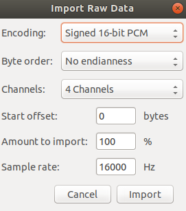

# Audio Streaming 

## **Content**
* [To Record and Playback](#to-record-and-playback)
* [To send message to another ubuntu PC using ethernet crossover cable](#to-send-message-to-another-ubuntu-pc-using-ethernet-crossover-cable)
* [trx: Realtime audio over IP](#trx-realtime-audio-over-ip)
* [Beamform](#beamform)
* [Other Potential References for Beamforming](#other-potential-references-for-beamforming)

## To Record and Playback

**Steps:**

To Record: ` arecord -D hw:0,0,0 -f S16_LE -c 2 -r 48000 recorded.wav` and To Play: `aplay recorded.wav`

**For XMOS Microphone array:**
* run ./[xmos_recorder.sh](./xmos_recorder.sh)  It uses Gstreamer

**Reference:**
* [Raspberry Pi Wiring & Test](https://learn.adafruit.com/adafruit-i2s-mems-microphone-breakout/raspberry-pi-wiring-and-test)
* [Playing with ALSA loopback devices](https://sysplay.in/blog/tag/arecord/)

**Note:**
* Do this in order to check the quality of the hardware.

## To send message to another ubuntu PC using ethernet crossover cable

**Steps:**
* Connect both the PC by ethernet crossover cable.
* Go to wired network setting -> IPv4 ->  select Link-Local Only in both the PC.
* Find your the local ip address by `hostname -I` , say for PC1: `169.254.21.232` and PC2: `169.254.31.155`
* You can test the connection by `ping <ip-addrress-of-other-PC>`
* On the receiving computer do `nc -l 3333`
* On the sending computer do `nc <ip-addrress-of-receiving-PC> 3333`
* Then just start typing and the text will show up on the other computer (after you press enter) until you hit ctlr+c. 

**Troubleshoots**
* If you are able to ping. But, still not able to send and receive messages then your firewall might be blocking: [Do answer 2](https://superuser.com/questions/560969/ncat-only-works-in-certain-scenarios/561848)

## trx: Realtime audio over IP

**Steps:**
 * Download `wget www.pogo.org.uk/~mark/trx/releases/trx-0.3.tar.gz` and Unzip it`tar xvf trx-0.3.tar.gz`
 * Make sure you have the dependencies or else install it by: `sudo apt install libortp-dev libopus0 libopus-dev libasound2-dev alsa alsa-tools`
 * `cd trx-0.3` and `sudo make` to build and `sudo make install` to install the binaries
 *  To send audio from default soundcard to the given host: `sudo tx -h 169.254.88.116` and to receive audio and play it: `rx`
 *  For sending audio from a specific device to specific port: `sudo tx -h 10.255.43.100 -d plughw:2,0 -p 5555` & `sudo rx -h 10.255.43.100 -p 5555`  the ip address is the address of the client.
 *  To receive it using ffmpeg: `ffplay rtp://169.254.88.116:1350 -acodec opus` (**ffmpeg has cross platform support**)

**Reference:**
* [Official page](http://www.pogo.org.uk/%7Emark/trx/)

**Note:**
* **Works well...! :smiley:**

**Troubleshoots**
* sched_setscheduler: Operation not permitted: [1](https://forums.developer.nvidia.com/t/operation-not-permitted-by-using-sched-setscheduler/70114)
* Home directory not accessible: Permission denied: (sudo su) But, other solutions?
* `pulseaudio --start` to start pulseaudio. Ref [1](https://askubuntu.com/questions/15223/how-can-i-restart-pulseaudio-without-having-to-logout)

## Beamform 

**For ODAS &  [XMOS Microphone array](https://www.xmos.com/products/voice/micarray)**

1. Install odas, follow the steps [here](https://github.com/introlab/odas/wiki/installation).
2. Then [install odas web](https://github.com/introlab/odas_web)
3. Go to odas web directory and run `npm start`
4. In another terminal, go to `/odas/bin` and then make sure to have [this config file.](./myConfigFile_OK.cfg)
5. Find out the card and device number for the mic by `arecord -l` and enter those values in the config file.
6. Now, run `./odaslive -c myConfigFile_OK.cfg -v`

For Sound Source Localization (ssl), Sound Source Tracking (sst) and  Sound Source Separation (sss) modify the [various parameters](https://github.com/introlab/odas/wiki/configuration).

You will get two audio files, nameley, `postfiltered.raw` and `separated.raw` . Open these file in [audacity](https://www.audacityteam.org/) --> files --> import --> raw amd select th following settings:

**To listen in a specific direction**

* [To record in a specific direction](https://github.com/introlab/odas/issues/158)
* [I get only the activity of energy in a particular direction but I want to listen to the audio in that direction. ](https://github.com/introlab/odas/issues/187)
* [To change the directions in real-time use injector moudle (sockets update the direction), but it is not yet implemented.](https://github.com/introlab/odas/issues/14)

ODAS github issues which are useful:
* [Can I record the sound only in fixed direction?](https://github.com/introlab/odas/issues/158)
* [Potential Sorces Energy Range](https://github.com/introlab/odas/issues/28)
* [Beamforming Vector application ](https://github.com/introlab/odas/issues/172)
* [beamforming range advice](https://github.com/introlab/odas/issues/14)
* [increase the gain](https://github.com/introlab/odas/issues/58)
* [Correlate the source with the separation channel](https://github.com/introlab/odas/issues/79)
* [Question regarding SSS](https://github.com/introlab/odas/issues/73)
* [result too bad](https://github.com/introlab/odas/issues/156)
* [Some question about mode of sss](https://github.com/introlab/odas/issues/70)
* [some question about related article.<Enhanced Robot Audition Based on Microphone Array Source Separation with Post-Filter>](https://github.com/introlab/odas/issues/59)
* [Changing the value of samplerate.mu.](https://github.com/introlab/odas/issues/45)
* [Various configuration questions](https://github.com/introlab/odas/issues/15)

## Other Potential References for Beamforming

1. [MIT beamforming](http://groups.csail.mit.edu/cag/mic-array/)
2. [ROS beamforming package](https://github.com/balkce/beamform) [example](https://github.com/balkce/beamform/issues/1)
3. [Acoular – Acoustic testing and source mapping software](http://www.acoular.org/)
4. [Pyroomacoustics](https://github.com/LCAV/pyroomacoustics)
5. [PulseAudio under the hood](https://gavv.github.io/articles/pulseaudio-under-the-hood/)
6. [Best Pulseaudio Mic Settings](https://github.com/BeanGreen247/BestPulseaudioMicSettings)
7. [Beamforming in PulseAudio](https://arunraghavan.net/2016/06/beamforming-in-pulseaudio/)
8. [Binaural sound source localization - Software](http://www.laurentcalmes.lu/soundloc_software.html)
9. [Microphone Array Beamforming](http://www.labbookpages.co.uk/audio/beamforming.html)

**Approach for real-time beamforming:**
1. Record the sound in the actual environment.
2. Perform offline beamforming in Matlab to make sure your algorithm works.
3. Use [trx](http://www.pogo.org.uk/~mark/trx/) as the base and implement your algorithm by having [ODAS](https://github.com/introlab/odas) and [ROS package](https://github.com/balkce/beamform) as a reference.

**Why not directly use ODAS and ROS package?**

I achieved basic results in both libraries that worked but were not reliable. Thus, in order to improve reliability, we need to understand the problem in-depth and fine-tune based upon our system.
